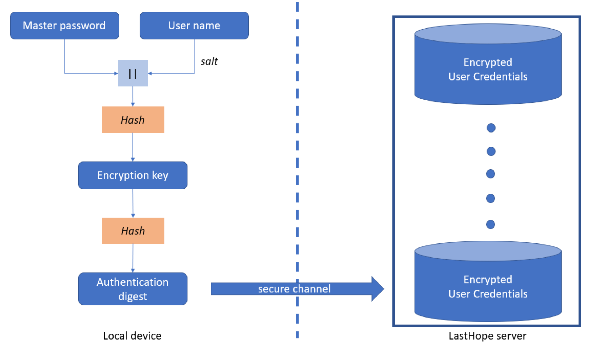

# Questions
Made by [Davide Andreolli](https://rroll.to/sOPjVJ) 

## Jul 04, 2023

### Question 2 

> In the context of password based authentication, describe:
> - Multi-factor authentication 
> - What is its purpose 
> - The three available factors, along with an example 
> - The three NIST-defined assurance levels.

L'autenticazione multi-fattore si basa sull'implementazione di un sottogruppo dei seguenti fattori:
- **Conoscenza**, autentica l'utente chiedendo un informazione privata (i.e. password)
- **Possesso**, autentica l'utente chiedendo di dimostrare il possesso di un elemento riconoscitivo fisico (i.e. smart card, token, smartphone)
- **Attributo**, autentica l'utente valutando i suoi attributi biometrici (i.e. impronta digitale, iride)

L'**MFA** nasce per rafforzare le debolezze dell'utilizzo del singolo fattore di sicurezza, che da solo può essere vittima di malintenzionati (i.e. furto, clonazione). 

Il **NIST** classifica le tipologie di **MFA** in base alla sicurezza con cui un sistema può assicurare l'identità di un utente.

1. Il primo livello (**MFA1**) richiede che vengano implementati almeno due diversi fattori di sicurezza, tra cui la password o un pin e qualcosa che l'utente possiede, come una smartcard.
2. Il secondo livello (**MFA"**) richiede che l'oggetto fisico posseduto nel livello 1 sia sostituito con un fattore biometrico, come l'impronta digitale o il riconoscimento facciale.
3. Il terzo livello (**MFA3**) è il più restrittivo e richiede che tutti e tre i fattori di sicurezza vengano implementati. Dunque l'utente, per affermare la propria identità, doovrà dimostrare di conoscere un informazione come una password, mostrare un documento identificativo fisico come una smartcard e inserire un proprio attributo biometrico.

### Question 1

> In the context of TLS and the PKI, describe:
> - what a digital certificate is and what are its main components
> - what a root CA is 
> - how a system can validate a certificate
> - TLS 1.2 handshake works by drawing the message sequence chart and
briefly describing each step 
> - how TLS ensures authentication, confidentiality, and integrity

Un certificato digitale è un file che certifica il binding tra un'entità e la propria public key. Ciò permette di poter comunicare con un'altra entità con certezza della sua identità, utilizzando la **PKI** per evitare attacchi **Man-In-The-Middle**.

Il certificato è firmato da un **Certification Authority**, che attesta la correttezza e l'integrità del documento rilasciato. Per verificare che anche il **Certification Authority** sia autentico, si procede ricorsivamente a validare anche i certificati dei **CA**, fino a trovare un **root-CA**. I **root-CA** sono dei speciali **CA** le quali public keys sono *hard-codate* nella memoria dei dispositivi. Ciò può essere, però, vulnerabile ad aggiornamenti malevoli di sistema, che potrebbero manomettere i certificati dei **root-CA** e **bypassare** l'intera infrastruttura dei certificati digitali.

Un'entità, per ottenere un proprio certificato digitale, deve riferirsi ad un **Registration Authority**, che si occupa di validare l'identità del richiedente. Se il risultato della validazione è positiva, l\'**RA** richiede al **CA** di fornire all'entità il nuovo certificato, fornendo i dati riguardo l'identità di essa. I **Validation Authorities** si occupano di confermare la validità di un certificato, controllando la presenza di revoche nella **CRL** e controllando le firme dei **CA**. Solitamente, il ruolo di **VA** lo svolge il browser.

Uno dei protocolli che implementa l'utilizzo dei certificati digitali è il **TLS**. Il **TLS** utilizza il **PKI** per permettere ai due capi della comunicazione di generare una **shared secret key** e criptare la sessione. 

Durante la fase iniziale del **TLS 1.2**, il client invia un messaggio detto **Client Hello**, dove notifica al server quali sistemi crittografici supporta e quale versione del **TLS** vuole usare.
In risposta, il server risponde con il **Server Hello**, contenente alcuni dati riguardo alla sessione, come l'ID, protocolli e *cypher suite*. Il messaggio contiene la **pre-master key**, che servirà per generare il **master secret**. Se richiesto dal client, il server dovrà inviare il proprio certificato **X.509** per iniziare la comunicazione autenticata. Il server potrebbe richiedere anche al client di inviare il proprio certificato per la mutua autenticazione.
Nel passaggio successivo il client, se richiesto, manderà il proprio certificato **X.509** e il **Certificate Verify**, una prova esplicita della verifica del certificato. Inoltre, invia il suo valore della **pre-master key**.
I due device, dopo aver terminato la parte di *handshake* precedente in modo corretto, inviano un byte `0xFF` dove confermano di accettare la **cypher suite** concordata.

Il **TLS** permette di assicurare, con un unico protocollo, che vengano rispettati tutti e tre i principi del **CIA**. 
- La mutua autenticazione viene effettuata durante la fase di *handshake*. I due dispositivi scambiano i certificati, in modo da verificare identità dell'utente, la scadenza o la revoca del documento.
- Tutte le comunicazioni successive all'handshake sono cifrate con la **secret key** concordata durante l'*handshake*, garantendo la confidenzialità dello scambio dei messaggi. Utilizzano un sistema di cifratura asimmetrica per lo scambio della chiave simmetrica, poi utilizzano la chiave concordata con l'algoritmo di cifratura simmetrica precedentemente concordato.
- Durante lo scambio dei messaggi viene aggiunto il *Message Authentication Code*, hash generato in funzione della **master key** e del contenuto del messaggi. Permette di valutare l'integrità di un messaggio e di confermare che non ci siano state modifiche dalla versione del mittente.

### Question 2

> In the context of data protection and privacy:
> - Give two possible definitions of privacy and briefly comment on them
> - Explain the linkage attack on anonymized dataset with an example
> - Explain the trade-off between anonymity and utility in the context of realizing data sets

**Privacy** è una parola che può avere diversi significati, che variano in base al contesto.
**Privacy** può essere intesa come il diritto di un utente di controllare il possesso e l'utilizzo dei propri dati personali da parte di un'organizzazione. Oppure **Privacy** può essere l'anonimità delle azioni che vengono svolte su una determinata piattaforma.

I **linkage attack** uniscono più database distinti, confrontandone gli attributi comuni. Utilizzano i cosiddetti **Quasi Identifiers**, degli attributi non univoci che permettono di avere una sufficiente correlazione con l'utente ma che, messi a confronto con altri **Quasi Identifiers**, permettono di distinguere un'entità univocamente.
L'utilizzo di un **Quasi Identifier** è sbagliato tanto quanto utilizzare l'intera identità dell'utente, ma a volta si pone necessario inserirlo per questioni di sicurezza o per effettuare degli studi su *dataset* che lo riguardano.

Una soluzione che pone un *tradeoff* tra privacy dei dati e capacità di effettuare analisi sul contenuto di essi può essere l'utilizzo della **K-anonimity**, un sistema che permette di generalizzare il contenuto del **Quasi Identifier** senza avere un'eccessiva perdita di dati. Il principio è che un record deve essere non identificabile tra almeno $k-1$ altri record.

### Question 3

> Describe a Cross-Site Scripting attack and the main mitigations that can be used to prevent it

Il **Cross-Site Scripting** è una vulnerabilità a livello applicazione che permette di eseguire codice malevolo sul browser dell'utente attaccato. Ciò è causato dalla mancanza di filtri adeguati sui parametri inviati dai client da parte della pagina web, che possono iniettare tag **HTML** oppure codice **JavaScript** all'interno di form oppure all'interno di un\'**URL**.
È utilizzato principalmente per il furto di chiavi di sessione e di informazioni private salvate nel browser dell'utente. Può anche indirizzare l'utente su siti di **phishing** per sottoporlo ad altri tipi di **vulnerabilità**.

I due tipi principali di **XSS** sono:
- **Reflected XSS**: il contenuto malevolo è all'interno dell'**URL**
- **Stored XSS**: il contenuto malevolo è precedentemente stato pubblicato su un forum ed è contenuto nel database della piattaforma

## Jan 27, 2023

### Question 1

> LastHope offers a password manager service structured as depicted in the figure.

>  

> When users create accounts on their devices, they set a user name and a master password. The former is used as a salt that is concatenated with the latter (see the box labeled with `||` in the figure) and then hashed to create a digest that is, in turn, used to generate an encryption key for encrypting all credentials of a user before sending them to the LastHope server. Then, the encryption key is hashed again and an authentication digest is sent to the LastHope server over a secure channel. In the LastHope server, a database of credentials is created for each user where the authentication digest is stored together with all the user's credentials.
> You are a security expert paid to comment on the password manager service and, in particular, to answer the following questions:
> 
> 1. Which of the available hash function algorithms would you advise using in the Local device? Motivate your answer, highlighting advantages and possible disadvantages.
> 2. Is it secure enough to use the user name as the salt to derive the encryption keys? Motivate your answer and suggest, if the case, possible extensions.
> 3. Which security service would you adopt to make the communication channel between the Local device and the LastHope server secure? Motivate your foganswer and discuss possible configuration problems of the proposed security service.
> 4. Which encryption primitive would you suggest adopting by the LastHope server to encipher the credentials in each user database? Motivate your answer.

Ritengo che il sistema che il servizio **LastHope** usa per criptare le password sia fallaceo. 
L'utilizzo del solo username per effettuare il **salting** dell\'**hash** della **encryption key** fa sì che se un utente avesse la stessa password per più servizi distinti, allora produrrebbe lo stesso **cypher text**. Dunque un malintenzionato, dopo aver ottenuto l'accesso ai record di un database, avrebbe la possibilità vedere ad occhio nudo quali utenti utilizzano la stessa password per più servizi. Può usare questa informazione per effettuare degli attacchi mirati ed aumentare l'efficacia della ricerca di password mediante *bruteforce* o tecniche analoghe. 

Una soluzione possibile è concatenare alla password e l'username anche un identificativo univoco del servizio per il quale si sta salvando la password. Di conseguenza, si otterrebbe un\'**encryption key** diversa per ogni password salvata. Risolve il problema riscontrato e non aggiunge *overhead* all'infrastruttura. 

Inoltre, il sistema dell\'**authentication digest** lo ritengo fortemente debole in quanto permanente (fino a che non viene cambiata la master password). Dunque non ha scadenza e non può essere revocato senza bloccare l'intero accesso alle password per l'utente. È opportuno che **LastHope** implementi un nuovo sistema di autenticazione, magari utilizzando la **master password** per validare l'accesso e fornire poi all'utente un **token** non dipendente dalla password principale. 

Il metodo con cui criptare e decriptare le password deve essere **simmetrico** siccome, come descritto dal diagramma, l'utente deve poter accedere alle proprie password mediante la **master password** e non attraverso altri metodi come certificati digitali o altri sistemi biometrici. L'algoritmo che userei per criptare le password è l\'**Advanced Encryption Standard**, con chiave a **256 bits**. La chiave sarà la **encryption key**, che dovrà usare un sistema di *hashing* sicuro per nascondere il contenuto delle chiavi. Consiglio l'implementazione dello **SHA3-256**. In questo modo, grazie alla combinazione di **master password**, **username** e **ID del servizio** l'utente riesce ad ottenere la password in modo sicuro e pratico.

La trasmissione dei dati tra utente e server deve **assolutamente** rispettare pienamente i principi di **confidenzialità** e **integrità**, in quanto il rischio che riscontra la piattaforma e l'utente nella trasmissione di password è critica. La maniera corretta è affidarsi all'ultima versione del **TLS**.

### Question 2 

> In the context of access control, describe the general architecture of an access control enforcement mechanism including:
> - subjects 
> - requests 
> - guard
> - policy 
> - isolation boundaries 
> - audit log 
> - the role of authentication and authorization

L\'**Access Control** è il processo che permette di garantire o negare l'accesso di una risorsa ad un utente in base a delle **policies**.

La sua architettura è composta da:
- **Soggetto**: L'entità che effettua la richiesta
- **Request**: La richiesta di accesso ad una risorsa
- **Guard**: Servizio che controlla le **Policies** e decide se una richiesta è autorizzata o meno. È detto anche **Policy Decision Point** e si occupa di aggiungere informazioni negli **Audit Log** riguardo agli eventi riscontrati
- **Policy**: Set di regole e requisiti che le richieste devono rispettare per accedere ad una risorsa protetta da essa
- **Isolation Boundaries**: È l'area di competenza di un **Guard**, dove risiedono tutte le risorse soggette alle decisioni di esso. All'interno dei *boundaries*, le richieste vengono filtrate dal **PDP**. Delimita l'**Access Control Module**
- **Audit log**: Registro delle richieste e delle operazioni effettuate dal **Guard**, contenuto all'interno dell'**Access Control Module**

### Question 3

> Define the notions of Confidentiality, Integrity, and Availability

**CIA** è l'acronimo di:
- **Confidenzialità**: Non dovrebbe permettere la divulgazione un'informazione privata
- **Integrità**: Un'informazione non dovrebbe essere manomessa da entità non autorizzate
- **Disponibilità (Availability)**: Un'informazione dovrebbe essere sempre disponibile

Sono tre pilastri fondanti dell\'**Information Security**.

## 24 Feb, 2023

### Question 1

> The BrokenWare company uses a tool capable of deploying and serving virtual computers. The tool contains a critical flaw that can be exploited to compromise any system. The vendor releases a patch for the vulnerability on 23 February 2021, but BrokenWare does not update its systems.
> 
> At the beginning of February 2023, the company is hit by a ransomware that is able to encrypt all the company data by exploiting the unpatched vulnerability.
> 
> You are a security expert paid to comment on why it is virtually impossible to decrypt BrokenWare’s data without paying the ransom. 
> 
> Specifically, you should explain the reason by first defining the notions of
> - cryptosystem
> - Kerckhoffs principle
> - key management and its purpose
> - symmetric key cryptography
> - asymmetric key cryptography
> 
> Finally, you should describe
> - which security architecture and best practices could have mitigated this kind of attack

Un **Cryptosystem** è un set composto da 5 elementi: 
- $E$: **Encryption Algorithm**
- $D$: **Decryption Algorithm**
- $M$: **Plaintext Messages**
- $K$: **Keys**
- $C$: **Cyphertext Messages**

Dove:
- $E: K \times M \rightarrow C$
- $D: K \times C \rightarrow M$

Il **principio di Kerckhoffs** dice che non bisogna fidarsi della segretezza di un algoritmo per ottenere protezione; serve invece valutare la segretezza della chiave. 
L'algoritmo deve rendere un messaggio, se non matematicamente, almeno fisicamente impossibile da decifrare.

Il **Key Management** è il processo di mantenimento di una chiave di cifratura, dalla sua creazione al suo utilizzo, alla distribuzione e alla sua distruzione.
La sua gestione è importante per poter rispettare i principi di **Confidenzialità**, **Integrità** e **Disponibilità**

La **Cifratura Simmetrica** è un **Cryptosystem** tale che
$D(k, E(k, m)) = m \quad | \quad m \in M, k \in K$, 
ovvero che la chiave è la stessa sia nella fase di cifratura che nella case di decifratura. Nonostante ciò, non è detto che gli algoritmi di cifratura $D$ ed $E$ siano gli stessi.

Al contrario, nella **Cifratura Asimmetrica**, le due chiavi di cifratura sono diverse, di cui una definita pubblica e l'altra privata. Una delle due chiavi è applicabile sulla funzione $D$, ovvero è la chiave di decifratura. L'altra, invece, sulla funzione $E$, detta chiave di cifratura. La chiave pubblica può essere diffusa pubblicamente, mentre la chiave privata deve essere mantenuta segreta dal titolare delle due chiavi.

Per prevenire questi tipi di attachi è necessario che un team di specialisti effettui delle continue metriche e test sull'infrastruttura ICT dell'azienda, in modo da ottenere informazioni riguardo a falle e sistemi informatici con versioni datate. Se l'azienda, nel contesto descritto, avesse avuto delle **metriche** riguardanti le patch di sicurezza, avrebbe potuto evitare di contrarre attacchi simili.

### Question 2

> In the context of the Diffie-Hellman key exchange, describe:
> - the protocol
> - the Men-In-the-Middle (MITM) attack
> - how it is possible to mitigate the MITM attack

Il **Diffie-Hellman key exchange** è un protocollo che permette a due dispositivi di scegliere e scambiare una **shared secret key** senza doverla inviare in chiaro su di un mezzo trasmissivo.

Inizialmente i due capi della comunicazione scelgono:
- $p$: un numero primo, il modulo dell'algoritmo
- $g$: la base della potenza, detta **generatore**

Poi scelgono privatamente un numero, abbastanza grande da resistere ad attacchi di **bruteforce**. In seguito calcolano:
$$ A = g^a\mod p $$
$$ B = g^A\mod p $$
$A$ e $B$ sono le corrispettive chiavi pubbliche, che possono procedere a scambiarsi. 

Ora, per creare la **shared secret key** $K$, basta che i due svolgano:

$$ K = g^{a*b}\mod p = B^a \mod p = A^b \mod p = g^{b*a} \mod p $$

Lo scambio da solo non basta per fornire autenticazione, dunque serve associare un altro **security mechanism** per evitare vulnerabilità del tipo **Man-in-the-Middle**.

Nel **Man-in-the-Middle**, un malintenzionato si pone in mezzo alla comunicazione tra due entità. Può violare l'integrità e la confidenzialità del messaggio. Dunque è bene applicare gli adeguati sistemi di autenticazione per risolvere questo tipo di vulnerabilità, ad esempio mediante l'utilizzo di sistemi a cifratura asimmetrica o all'implementazione di protocolli come il **TLS**.

### Question 3 

> Define the notions of vulnerability and threat and give (at least) an example for each one.

Una **vulnerabilità** è una falla all'interno di un sistema informatico, in una rete o in un processo aziendale che può dar spazio ad **exploits** eseguiti da malintenzionati, detti **threats**.
Le vulnerabilità agiscono su diversi lati di un'infrastruttura:
- **Application Layer**: SQL Injection, XSS Scripting, Cross-Site Request Forgery
- **Server Layer**: Denial-of-Service, OS Exploitation
- **Network Layer**: Man-In-The-Middle, DSN Attack
- **User Layer**: Phishing, Ransomware, Key-Logging

## Aug 25, 2022

### Question 4

> Explain the framework of Attribute Based Access Control (ABAC), in particular how an access request is processed, and the reasons for which it has been introduced with respect to previous models (such as RBAC).

L'**Attribute Based Access Control** è una tipologia di **Access Control** che concede l'autorizzazione in base a 3 principali attributi:
- **User attributes**: nome, organizzazione, età, ...
- **Resource attributes**: titolo, autore, dimensione, ...
- **Environment attributes**: data attuale, geolocalizzazione, situazione attuale di sicurezza (attività degli hacker), ...

Queste **policies** possono confliggere tra loro, dunque si può procede in due maniere:
- **Permit Overlay**: Si procede a concedere l'accesso, più libertà
- **Deny Overlay**: Si procede a bloccare l'accesso, più restrittivo

**ABAC** sostituisce altri sistemi più semplici, come **RBAC**, nelle situazioni in cui il controllo del solo ruolo può non essere abbastanza elastico. Dunque si aggiungono altri elementi su cui valutare l'accesso alle risorse.

## Jul 28, 2022

### Question 1

> Define the notion of hash function and its main properties: 
> - Ease of computation 
> - Compression 
> - One-way 
> - Weak collision resistance 
> - Strong collision resistance.

Una **funzione hash** è una **1-way function** che, dato un parametro di lunghezza variabile, genera un **digest** di dimensione fissa. È detta **1-way** perchè deve essere facile da calcolare (i.e. usando moltiplicazioni e potenze) ma difficile computazionalmente da invertire (logaritmi e fattorizzazioni).

Una buona funzione **hash** ha le seguenti caratteristiche:

- **Facilità di computazione**: Data la funzione di **hash** $h$, calcolare $h(x)=y$ è computazionalmente molto facile
- **Compressione**: Dato un parametro di lunghezza in bit variabile, la funzione $h$ genera un digest di lunghezza in bits fissa
- **One-Way**: Deve essere computazionalmente difficile e inconveniente provare ad invertire la funzione, ovvero calcolare $x \space \text{t.c.} \space h(x) = y$
- **Weak Collision Resistance**: Noti $x_1$ e $h(x_1)$, è computazionalmente arduo trovare un altro $x_2$ tale che $x_1 \neq x_2$ e $h(x_1) = h(x_2)$
- **Strong Collision Resistance**: Deve essere arduo computazionalmente trovare dei valori $x_1$ e $x_2$, tali che $x_1 \neq x_2$ e $h(x_1) = h(x_2)$ 
- **Effetto Cascata**. Una buona funzione **hash**, anche ad una minima variazione del parametro $x$, cambia molto il valore di $y$

### Question 3 

> Explain the notion of Multi-level security by illustrating it with the Bell-La Padula model; in particular discuss the notions of 
> - security level
> - need-to-know
> - dominance relation 
> - no-read-up rule
> - no-write-down rule.

Il **Multi-level Security** è un sistema che etichetta le risorse con un **Sensitivity Label** $L = (S,N)$, dove:
- $S$ è un **set ordinato di priorità**, come $\text{TopSecret} \ge \text{Secret} \ge \text{Confidential} \ge \text{Unclassified}$
- $N$ è un **set non ordinato di topics** detto **need-to-know**, ovvero categorie che dovrebbero essere collegate solo a specifici gruppi di utenti. Ad esempio $\text{Crypto, Nuclear, Janitorial, ...}$

Nella fase di creazione, ogni risorsa è associata alla combinazione di due elementi di $S$ e $N$.

Ad ogni utente è associato un **livello di autorizzazione** detto **clearence**, $C: (S,N)$, dove $S$ è il livello massimo di **Security Level** che può raggiungere, mentre $N$ è un set di categorie **need-to-know** a cui l'utente è interessato ad operare.

Seguendo il **Modello di *Bell-La Padula***, applichiamo:
- **No Read-Up Property**: una risorsa è accessibile solo se i permessi del soggetto richiedente sono maggiori o uguali a queli della risorsa richiesta
- **No Write-Down Property**: i permessi di una risorsa, per essere scritta, deve dominare i permessi del soggetto richiedente.

Il precedente modello punta a conservare la confidenzialità delle risorse a discapito, però, dell'integrità di esse.

### Question 4 

> Briefly describe the notion of Data Protection Impact Assessment (DPIA) according to the Art. 35 of the GDPR.

L\'**articolo 35** del **GDPR** parla del **Data Protection Impact Assessment**, un documento che deve essere redatto da un'organizzazione prima di procedere a rendere attivo un servizio, dove descrive l'impatto che i dati che verranno raccolti, come verranno processati e la criticità del sistema.

## Jun 23, 2022

### Question 2

> Describe an SQL injection attack. Which are the main mitigations to an SQL injection attack?

Gli attacchi **SQL Injection** sfruttano la mancante o non sufficiente **sanificazione** degli input di un form. Specifiche soluzioni di questa tipologia di vulnerabilità possono indurre il **DBMS** a modificare il comportamento della **query** prevista. In questo modo, malintenzionati possono andare ad ottenere informazioni non raggiungibili normalmente all'interno del database oppure andare a minare l'integrità dei dati al suo interno, modificandoli o eliminandoli.

Alcuni modi con cui è possibile evitare questa vulnerabilità sono:
- Sanificare tutti gli input forniti dall'utente
- Utilizzare i **Prepared Statements**, ovvero query parametrizzate
- Applicare il **principio di Least Priviledge**

### Question 4

> Define the notions of risk and vulnerability and give (at least) an example for each one.

Il **rischio** è la probabilità che un **exploit** venga utilizzato da un **threat** (o **hacker**). Il fattore di rischio può essere dettato dall'importanza di una risorsa e il danno che può causare se alterata o pubblicata.
Una vulnerabilità è una **debolezza** di un sistema informatico, causato da un errore di implementazione, un errore logico, un errore del sistema di sicurezza, etc. che può essere sfruttato da un malintenzionato per minare l'attività di un servizio. Una vulnerabilità può essere classificata in base all'impatto che un **exploit** di essa può portare. Ci sono degli standard industriali, detti **CVSS**, che permettono di valutare il grado di rischio di una **vulnerabilità** o **falla**.

## Feb 22, 2022

### Question 3

> In the context of access control, explain:
> - explain what is a confused deputy with the help of an example 
> - how capabilities allow for avoiding a confused deputy attack
> - explain the notion of Discretionary Access Control (DAC)
> - explain the notion of Mandatory Access Control (MAC)
> - discuss the main advantages and disadvantages between DAC and MAC.

Il **Confused Deputy** è un sistema di **Priviledge Escalation**, dove una avversario senza il permesso di accedere ad una risorsa, scrive all'interno di essa mediante un altro soggetto (detto **Deputy**). 
Il sistema di **Access Control**, non conoscendo da chi derivano i permessi ma notandone soltanto la presenza ereditata da uno dei soggetti coinvolti, concede l'accesso (**Permit overlay**).

In questo contesto, l'utilizzo dell\'**Access Control List** mediante l'implementazione esplicita delle **capabilities** annullerebbe il problema. Non può esserci confusione nel capire se un utente passa una **capability** ad un altro utente o servizio, dunque 

Il **Discretionary Access Control** (o **DAC**) è un sistema in cui un soggetto può conferire i propri permessi ad un altro soggetto, ad esempio un eseguibile. 
Al contrario, nel **Mandatory Access Control** (o **MAC**) solo gli amministratori possono modificare, rimuovere o fornire ulteriori accessi agli utenti.

Nel **Discretionary Access Control**, gli utenti sono posti in dei **gruppi**, per avere più facilità nell'archiviare i permessi degli utenti (**ACL** e **AC Matrix** di minor dimensione) soprattutto nelle grosse organizzazioni. Il sistema è flessibile, ma può risultare **vulnerabile** a **trojan** ed essere **inconsistente**.
Nel **Mandatory Access Control**, l'utente è associato ad un'organizzazione, che decide come i dati possono essere condivisi. Le risorse, solitamente, sono etichettate da delle **Security Labels**.

## Feb 1, 2022

### Question 1

> Explain how to protect a password file with hashing and salting; discuss 
> - what is hashing 
> - what is salting 
> - why hashing is not enough for protecting passwords and how salting mitigates the problem of hashing 
> - describe the structure of a password file 
> - explain if salts can be stored in clear

L\'**hashing** è l'applicazione di una funzione con cui, dato un parametro di lunghezza variabile, si ottiene un valore di lunghezza variabile, detto **digest**. È largamente usato per il salvataggio non occulto di password e per il controllo dell'integrità di file e oggetti. Dunque, per nascondere le password all'interno di un **password file** basta registrare, al posto della **password**, il suo **digest**. Poi, ogni volta che un utente prova ad effettuare il login, basterà calcolare allo stesso modo l\'**hash** della **password** data in input e verificare che sia lo stesso.

Una delle particolarità dell'hashing è che, dato una password $x$ e la funzione di hash $h$, ogni volta che si calcolerà $h(x)$, restituirà lo stesso **digest**. Per questo, una volta trovato l\'**hash** corrispondente ad una determinata **password**, è possibile confrontarla con la lista di tutti gli utenti e verificare facilmente chi ha la stessa **password**. Ciò si applica principalmente su password molto facili o banali. Esistono delle speciali liste di **hash**, dette **Rainbow Tables**, che contengono i digest delle **password** più utilizzate, che rendono molto facile il lavoro a malintenzionati che cercano di rompere un **password file**.

Un modo per evitare questo problema è concatenare alla **password** un cosiddetto **salt**, una stringa pseudocasuale. Così facendo, due utenti aventi la stessa password, hanno il **digest** diverso. Il **salt** deve essere associato all'utente e può rimanere non cifrato all'interno del password file, dato che un hacker in conoscenza della stringa dovrebbe ricalcolarsi tutte le combinazioni mediante **bruteforce**.

### Question 3

> In the context of the SAML standard 
> - explain its main goal 
> - describe the two scenarios for the Web Single Sign On profile 
> - explain how is it possible to guarantee trust in the assertions consumed by the relying party (*hint: remember that assertions are cryptographically signed*) 
> - explain how it is possible to avoid man-in-the-middle attacks.

Il **Security Assertion Markup Language** è uno standard che permette a due sistemi di autenticarsi e ad autorizzarsi mutualmente, in particolare nel caso degli **Identity Provider** e dei **Service Provider**.
È basato su **XML** ed ha lo scopo di contenere delle **Security Assertions**.

Viene largamente usato nel **Single Sign On**, un sistema in cui, con un unico profilo fornito dall\'**Identity Provider**, viene effettuato l'accesso con diversi **Service Provider**.

Il **Single Sign On** può essere inizializzato in due diverse maniere:
- Dall\'**Identity Provider**, che dopo aver autenticato l'utente, lo indirizza sulla piattaforma dell **Service Provider**, consegnandoli un certificato **SAML** contentenente gli **assertions** appartenente a quel sito (es. la tipologia di membership)
- Dall\'**Service Provider**, che dopo aver dato all'utente l'accesso a delle risorse senza vincoli di autorizzazione, procede a richiedere all'**Identity Provider** che esso venga autenticato. Una volta che l\'**Identity Provider** ha verificato l'identità dell'utente, lo reindirizza dal **Service Provider** con le **assertions** dell'utente. 

Si suppone in entrambi i casi che sia già stata creata una **federazione** tra i due **provider**, dunque che sia stata instaurata precedentemente **fiducia** tra di loro.

Per stabilire la corretta distribuzione delle **assertions**, il certificato contiene dei **Metadata** riguardanti l'identità di chi lo ha distribuito. Alcuni parametri sono i seguenti:
- **EntityId**
- **Chiavi crittografiche**, permettono di firmare digitalmente il file dall'emittente
- **Protocol Endpoints**, per la comunicazione e la verifica delle informazioni

Da solo, **SAML** non permette di garantire che la trasmissione del file avvenga con confidenzialità e in modo integro. Dunque è consigliato appoggiarsi su sistemi come il **TLS** per ottenere una comunicazione sicura.

### Question 4 

> Explain the notion of pseudo anonymization function, describe at least two possible implementations together with their advantages and disadvantages.

Una **funzione di pseudoanonimizzazione** produce un identità pseudocasuale applicabile ad un'identità, in modo da poter evitare di associare un informazione ad un'entità in chiaro. Ciò permette di garantire la privacy e di evitare **Linkage Attacks**.
Ci sono diverse possibili implementazioni di questa funzione:
- Un **Counter**, che cresce in maniera incrementale man mano che viene associato un numero ad un'entità
- Uno **Pseudo Random Number Generator**, che fornisce un numero pseudo casuale unico all'utente. È molto difficile da implementare ma è più flessibile del **Counter**

